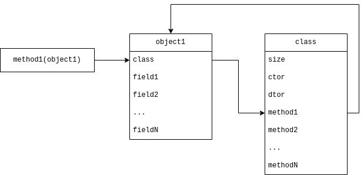

# c-data-structures

Библиотека обобщённых и абстрактных структур данных на языке программирования Си.

## Как использовать

### Обобщённые типы данных

Перед вставкой заголовочного файла с ОТД (читай далее), необходимо задать тип `T`.

```c++
#define T int
#include "vec.h"
#undef T

typedef void *pvoid;    // Без _t!
#define T pvoid
#include "vec.h"
#undef T

int main(void) {
    vec_int_t *v_int = vec_int_create(0);
    vec_pvoid_t *v_pvoid = vec_pvoid_create(0);
    ...
}
```

Важно! `T` должно быть идентификатором типа данных (не указателем!).

### Абстрактные типы данных

```c++
// Интерфейс АТД
#include "map.h"

// Конкретная реализация АТД
#include "hmap.h"

void *map = map_new(HashMapClass, arg1, arg2...);
map_insert(map, "key", 1);
```

### Список ОТД

- [vec.h](./inc/vec.h) - вектор, саморасширяющийся динамический массив.
- [slist.h](./inc/slist.h) - односвязанный список.
- [dlist.h](./inc/dlist.h) - двусвязанный циклический список.
- [queue.h](./inc/queue.h) - очередь на односвязанном списке (В РАЗРАБОТКЕ).
- [deque.h](./inc/deque.h) - дека (двусторонняя очередь) на двусвязанном списке (В РАЗРАБОТКЕ).

### Список АТД

- [map.h](./inc/map.h) - ассоциативный массив (словарь, мапа), сопоставляющая строке - целое число:
  - [bstree.h](./inc/bstree.h) - реализация `imap_t`, бинарное дерево поиска (bst, ДДП);
  - [shmap.h](./inc/shmap.h) - реализация `imap_t`, простая хэш-таблица из курса ТиСД ИУ7;
  - [hmap.h](./inc/hmap.h) - реализация `imap_t`, усовершенствованная хэш-таблица с использованием развёрнутого списка;
  - [avltree.h](./inc/avltree.h) - реализация `imap_t`, сбалансированное AVL дерево;
  - [radix.h](./inc/radix.h) - реализация `imap_t`, сжатое префиксное дерево (В РАЗРАБОТКЕ).
- [stack.h](./inc/stack.h) - стек, структура данных по принципу FIFO:
  - [astack.h](./inc/astack.h) - реализация `istack_t`, стек на векторе (массиве);
  - [lstack.h](./inc/lstack.h) - реализация `istack_t`, стек на односвязанном списке.
- [matrix.h](./inc/matrix.h) - матрица вещественных чисел:
  - [flat_matrix.h](./inc/flat_matrix.h) - реализация `imatrix_t`, хранение элементов матрицы в едином массиве.
  - [csr_matrix.h](./csr_matrix.h) - реализация `imatrix_t`, разреженная матрица с построчным хранением.

## Про АТД

Абстрактным типом данных (АТД) будет называть тип данных, реализация операций над которым неизвестна.

АТД имеет интерфейс, доступный клиенту, и одну или несколько реализаций, скрытых от внешнего кода.
Обычно в Си под интерфейсом понимают заголовочный файл `.h`, так как он часто скрывает реализацию типа данных:

```c++
// map.h
struct map;
typedef struct map map_t;

// map.c
struct map {
    ...
};
```

Однако у данного способа есть недостаток - невозможно использовать несколько реализаций интерфейса в рамках одной программы.
В общем случае это не является проблемой, однако перед автором стояла задача реализовать честный полиморфизм, без
магии препроцессинга (а там дальше полотно про ОТД на чистом препроцессоре, да-да...).

Источник - [Object-oriented Programming with ANSI-C](https://www.cs.rit.edu/~ats/books/ooc.pdf).
Основная идея, благодаря которой реализуется полиморфизм:

1. Объект есть бестиповый указатель `void *`.
2. Интерфейсные методы обращаются к _дескриптору_ в корне объекта.
3. Конкретная реализация _динамически связывает_ методы с объектом путём инициализации дескриптора.

На схеме:



Рассмотрим на примере ассоциативного массива ([map.h](./inc/map.h)) и реализации через хэш таблицу ([hmap.h](./inc/map.h)).

```c++
typedef struct {
    size_t size;
    void *(*ctor)(void *, va_list *);
    void (*dtor)(void *);
    void (*insert)(void *, mkey_t, mval_t);
    map_res_t (*lookup)(const void *, mkey_t);
    int (*remove)(void *, mkey_t);
} imap_t;
```

`imap_t` - дескриптор объекта. Данная структура должна быть в корне у любого объекта, реализующего данный интерфейс.

```c++
typedef struct {
    const imap_t *class;
    ...
} hmap_t;
_Static_assert(offsetof(hmap_t, class) == 0);
```

Рассмотрим подробнее.

```c++
size_t size;
```

`size` указывает на размер объекта, который зависит от реализации (объекты переменной длины не поддерживаются).
Функция создания нового объекта `map_new` выделяет память для объекта и частично инициализирует её:

```c++
void *p = malloc(class->size);
*(const imap_t **)p = class;    // записать в корень объекта его дескриптор
```

И лишь потом вызывает конструктор, если таковой присутствует:

```c++
if (class->ctor) {
    va_list ap;
    va_start(ap, class);
    p = class->ctor(p, &ap);
    va_end(ap);
}
```

Интерфейсные методы вызывают методы объекта из дескриптора:

```c++
const imap_t *const *cp = self;
(*cp)->insert(self, key, value);
```

Заголовочный файл реализации содержит объявление дескриптора, тем самым все объекты класса имеют указатели на одну и ту же таблицу методов.

```c++
extern const imap_t HashMapClass;
// map_new(HashMap, hash_function)
static const imap_t *HashMap = &HashMapClass;
```

Здесь же содержится указание, как вызывать конструктор типа.

Все методы содержатся в файле реализации и сокрыты от клиента.
Там же и происходит _динамическое связывание_ класса и его методов:

```c++
const imap_t HashMapClass = {
    .size   = sizeof(hmap_t),
    .ctor   = hmap_ctor,
    .dtor   = hmap_dtor,
    .insert = hmap_insert,
    .lookup = hmap_lookup,
    .remove = hmap_remove,
};
```

Реализация методов класса тривиальна, за исключением конструктора и деструктора:

- конструктор принимает на вход уже выделенную память;
- деструктор не вызывает `free()` от объекта, только освобождает дополнительно выделенную память полей объекта.

## Описание заголовочных файлов

### Вспомогательные файлы

#### err.h

`err.h` содержит константы основных ошибок (см. таблицу ниже) и макросы для работы с ними через возвращаемые указатели.

| Название | Код  | Описание                | Пример                                                |
|:--------:|:----:|:------------------------|:------------------------------------------------------|
|  `EIO`   | `5`  | Ошибка ввода-вывода     | Ошибка открытия файла или некорректные данные в файле |
| `ENOMEM` | `12` | Ошибка выделения памяти | `malloc` вернул NULL                                  |
| `EINVAL` | `22` | Некорректные данные     | Нулевой размер матрицы                                |

#### generic.h

`generic.h` содержит макросы для создания псевдо-обобщённых типов данных (далее - ОТД).

Создание ОТД происходит в несколько этапов. Рассмотрим на примете ОТД массива (`arr`), где в качестве типа элемента
выступает макрос `T`.

##### Макрос идентификатора ОТД

```c++
#define ARR(type) GENERIC_TYPE(arr, type)
```

##### Создание типа ОТД

Через ключевое слово `typedef`:

```c++
typedef struct {
    size_t len;
    T      data[];
} ARR(T);
```

##### Создание структуры ОТД

Если необходимо создать структуру типа данных (`struct`), как, например, для реализации связанных списков,
используется макрос `GENERIC_STRUCT`:

```c++
#define NODE(type) GENERIC_TYPE(node, type)
#define NODE_STRUCT(type) GENERIC_STRUCT(node, type)
typedef NODE_STRUCT(T) {
    NODE_STRUCT(T) *next;
    T               data;
} NODE(T);
```

##### Использование макросов

Далее объявление объекта _ОТД_ без конкретного значения имеет вид:

```c++
ARR(T) *arr;
```

Вместо `T` подставляется конкретный тип и выражение преобразуется в:

```c++
// T = int
arr_int_t *arr;
```

> ВАЖНО! Для указания конкретного типа псевдо-обобщённого типа данных допускается использование только 
> **идентификаторов** типа.

Не допускается использование указателей, структур:

```c++
GENERIC_TYPE(arr, void*)   // -> arr_void*_t
```

Вместо этого необходимо объявить идентификатор-синоним типа:

```c++
typedef void *pvoid;
GENERIC_TYPE(arr, pvoid)   // -> arr_pvoid_t
```

##### Метод ОТД

Необходимо создать макрос идентификатора функции через `GENERIC_METHOD`.

```c++
#define ARR_PUSH(type) GENERIC_METHOD(arr, push, type)
```

Далее объявить функцию с данным макросом.

```c++
ARR(T) *ARR_PUSH(T) (ARR(T) *self, T value);
```

##### Вызов методов ОТД

Можно вызывать методы ОТД, используя тот же макрос.

```c++
ARR(T) *arr = ARR_CREATE(T) (0);
```

Обратите внимание: скобки указываются дважды. Первый раз - для вызова макроса, преобразующего ОТД в конкретный ТД, второй
раз - для непосредственно вызова функции.

#### debug.h

`debug.h` содержит вспомогательные макросы для отладки.

Основной - `log_errorf`. При включенной директиве `DEBUG`, макрос `log_errorf` раскрывается в вызов `fprintf` в `stderr`.
Важно! `\n` добавляет автоматически.

#### str.h

`str.h` содержит вспомогательные макросы и функции для работы со строками, а также содержит синоним типа строки `string_t`.

##### string_t

Почему `string_t` есть `char`, а не `char *`?
Это сделано для того, чтобы акцентировать внимание на том, что строка это в первую очередь _указатель_.
В особенности, для создания указателей на постоянные строки и постоянных указателей на строки:

```c++
const string_t *str;
string_t *const str;

typedef string_t *pstring_t;
const pstring_t *str;   // ???
```

##### sfgets

`sfgets` - обёртка для `fgets` родом из курса Си ИУ7. 
Проверяет буфер на переполнение наличием символа `\n`, а также автоматически его удаляет из прочитанной строки.

## Контакты

- [@zhikhkirill](https://t.me/zhikhkirill).
